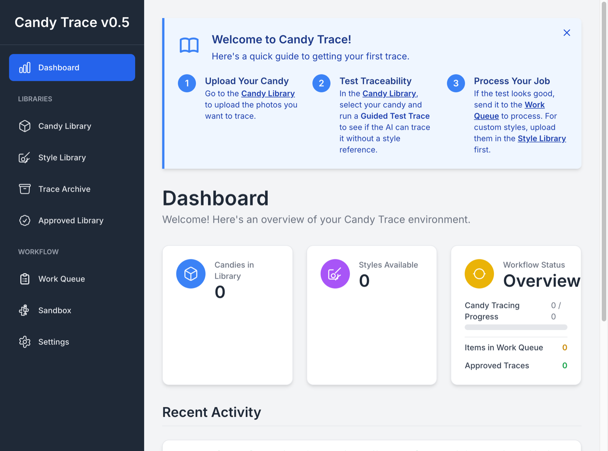
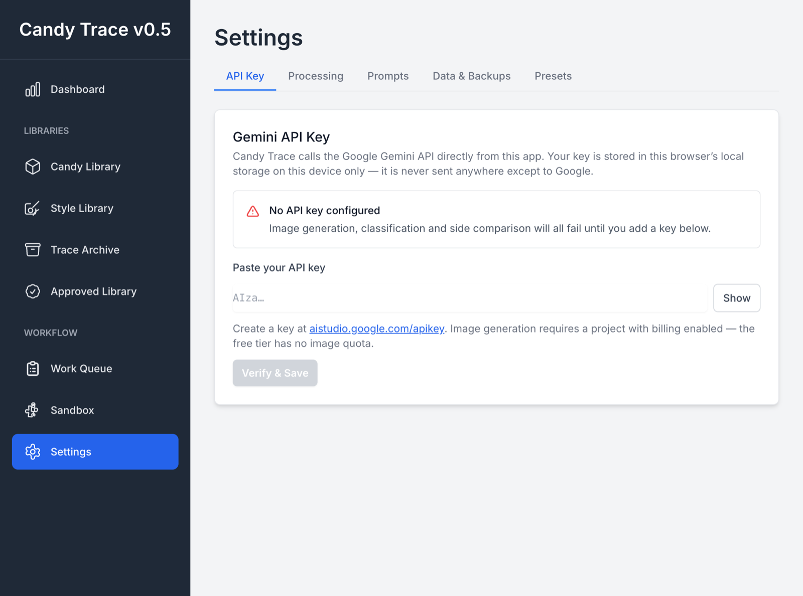
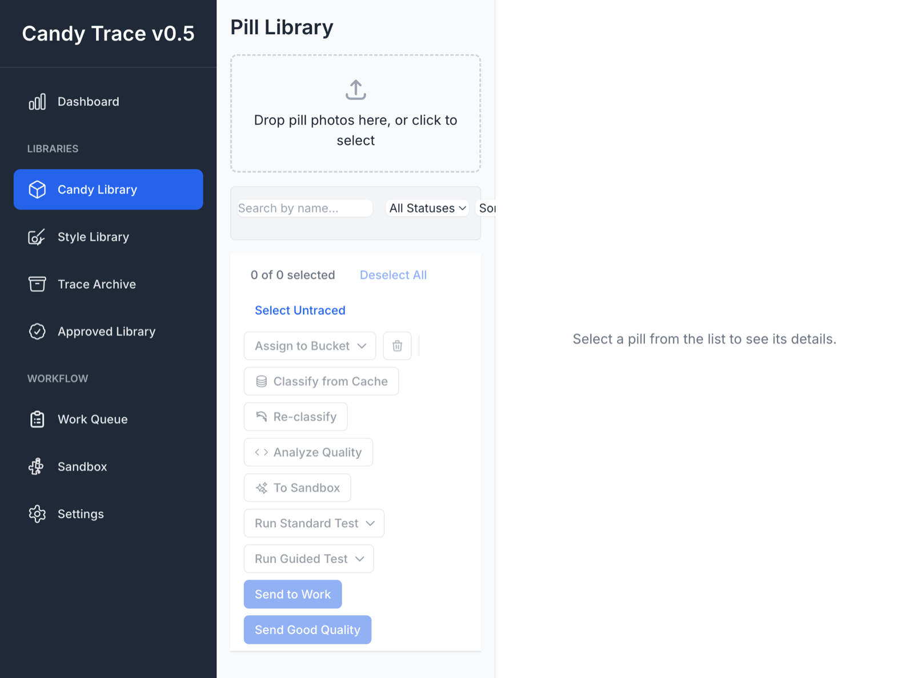
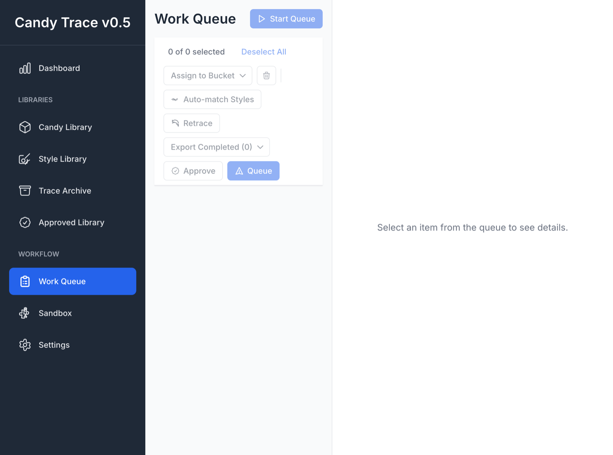
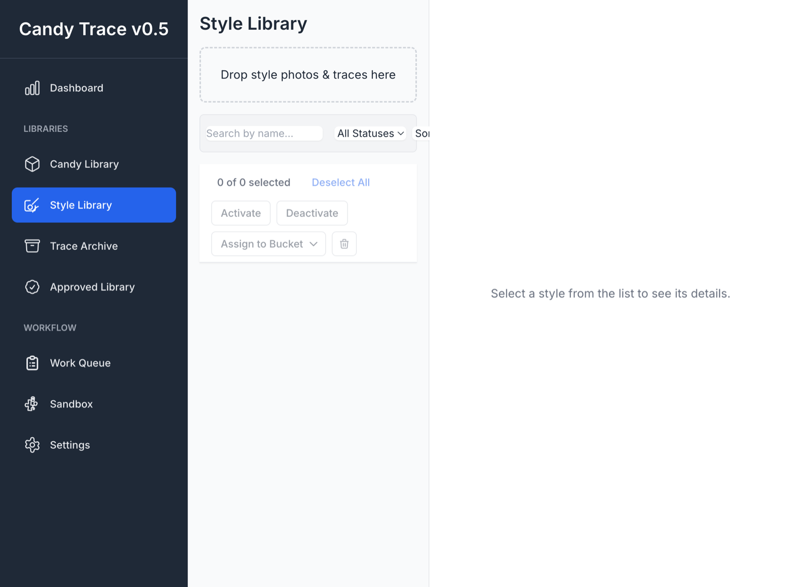
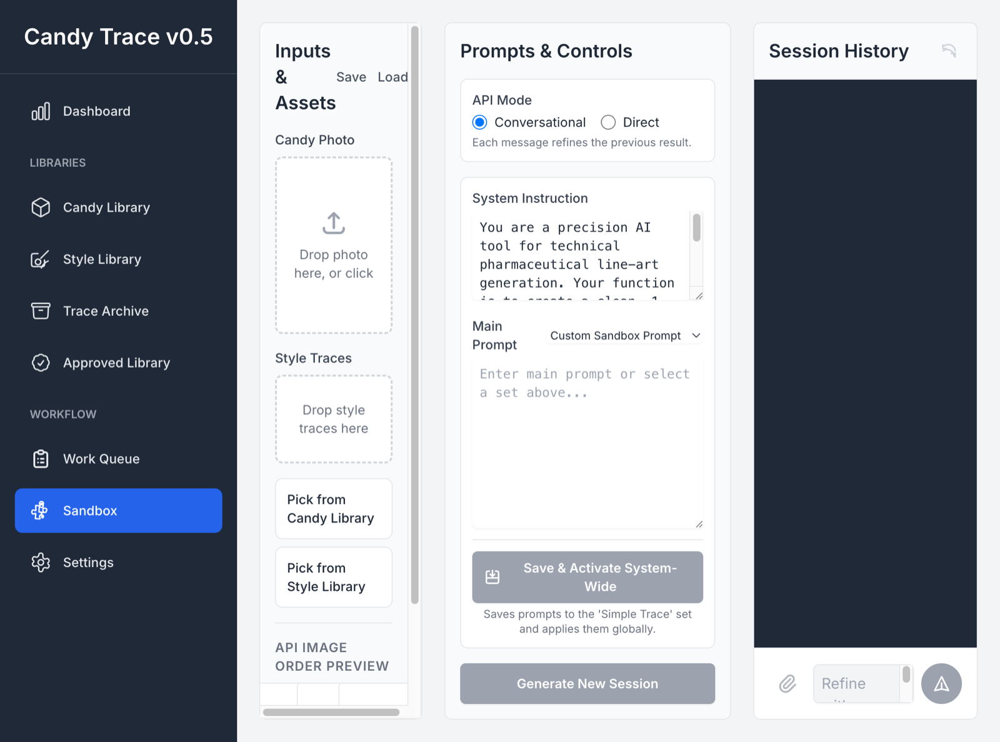

<p align="center">
  
</p>

# Candy Trace

> Turn product photography into precise, 1-bit technical line art using the Google Gemini API.

<p align="center">
  
</p>

Candy Trace is a local-first workspace for producing clean, consistent, style-matched line art
from photographs at scale. It runs as a web app or as a native macOS app, keeps all your data on
your own machine, and talks directly to Google's Gemini API with a key you supply.

**Status: proof of concept.** It works end to end, but see [Known limitations](#known-limitations)
before relying on it for production work.

### Who it's for

Cataloguing tablets and confectionery often calls for a **1-bit line drawing** — pure black
contours on white — of the outline, the embossed or debossed mark, the score line and the bevel.
Tracing those by hand in Illustrator is slow and inconsistent across hundreds of items. Candy
Trace replaces that with three things working together:

- **Style-aware tracing.** You supply reference pairs (a photo plus a hand-made trace). The model
  learns line weight, how bevels are drawn and how imprinted text is rendered from *your*
  examples, not a generic style.
- **Shape classification.** Every photo is sorted into a shape bucket first, so a hexagonal tablet
  is matched to a hexagonal style reference rather than a round one.
- **Two-sided intelligence.** Front and back are handled as a pair. *Compare Sides* asks the model
  whether side B differs enough to need its own trace, or can reuse side A's result.

Built for designers, archivists and QC teams who need consistent output at scale.

---

## Quick start

```bash
npm install
npm run dev
```

Open <http://localhost:3000>, go to **Settings → API Key**, and paste a Gemini API key from
[aistudio.google.com/apikey](https://aistudio.google.com/apikey).

The key is stored in your browser's local storage on that device only. It is never committed,
never bundled, and never sent anywhere except to Google's API.

> **Image generation needs a paid Google Cloud project.** The Gemini free tier has no quota for
> `gemini-2.5-flash-image`, so trace generation returns HTTP 429 on a free key. Shape
> classification (`gemini-2.5-flash`) does work on the free tier.

---

## Native macOS app

```bash
npm run app:build
```

Produces `Candy Trace.app` and a `.dmg` in `src-tauri/target/release/bundle/`.

Requires [Rust](https://rustup.rs) and Xcode command line tools. For development with hot reload:

```bash
npm run app:dev
```

The bundle is **not code-signed**. On first launch macOS will block it; right-click the app and
choose *Open*, or run `xattr -dr com.apple.quarantine "/Applications/Candy Trace.app"`. To
distribute it properly you need an Apple Developer ID certificate and notarization.

---

## Screenshots

| | |
| --- | --- |
|  |  |
| **Dashboard** — library counts, queue state, activity log | **Settings → API Key** — your key, verified live, stored on this device |
|  |  |
| **Candy Library** — drop photos, auto-classify by shape | **Work Queue** — match styles, run the batch, approve results |
|  |  |
| **Style Library** — photo + hand-made trace pairs that define the line style | **Sandbox** — multi-turn prompt experiments on a single image |

Captured from the current build with an empty workspace. Sample photos are not
included in this repository; bring your own and follow the [naming convention](#file-naming-convention).

---

## How it works

Candy Trace is organised around a linear workflow, one view per stage:

| View | What it does |
| --- | --- |
| **Dashboard** | Overview of libraries, queue state and recent activity |
| **Candy Library** | Upload source photos; auto-classify each item into a shape bucket |
| **Style Library** | Curate photo + hand-made trace pairs that teach the AI your line style |
| **Work Queue** | Configure and run batch jobs; auto-match candies to styles |
| **Trace Archive** | Searchable archive of every generated trace |
| **Approved Library** | Traces you have marked production-ready; batch-export as ZIP |
| **Sandbox** | Multi-turn chat interface for prompt engineering and one-off generations |

**Typical run:** upload style references → upload candy photos → send to Work Queue →
Auto-Match Styles → Start Processing → review and approve → export from Approved Library.

### Models used

| Task | Model |
| --- | --- |
| Line-art generation | `gemini-2.5-flash-image` |
| Shape classification, side comparison | `gemini-2.5-flash` |

Both are set in `services/geminiService.ts` and `constants.ts`.

### Shape buckets

Classification places each item into one of these buckets (defined in `constants.ts`). Style
references live in the same buckets, and *Auto-Match Styles* only pairs within a bucket.

| Bucket | Typical items |
| --- | --- |
| Round | Circular tablets, dragees |
| Oval/Oblong | Capsules, elongated lozenges |
| Square · Rect/Logo | Square tablets; rectangular pressings carrying a logo |
| Bar/Brick (Horizontal) · Bar/Brick (Vertical) | Bar-shaped pressings, by orientation |
| Shield/Emblem · Crest/Badge | Heraldic and badge-shaped outlines |
| Face/Head | Character heads and faces |
| Hex/Polygon · Diamond/Kite · Triangle | Geometric outlines |
| Rocket · Bottle · Bag · Heart · Tab/Quarter | Recognisable object silhouettes |
| Novelty/Other | Anything irregular that fits nothing above |
| Unassigned | Not yet classified, or set manually |

---

## File naming convention

Automatic parsing depends on these patterns.

**Candy photos** — filename ends with the side marker:

```
MyPill_A.jpg        CoolCandy_front.png
[Name]_[A|B|1|2|front|back].[jpg|png|webp]
```

**Style files** — a photo plus its corresponding hand-made trace:

```
ThickContour_A.jpg          ← the photo
ThickContour_trace_A.png    ← the 1-bit trace
[Name]_[A|B].[jpg|png|webp]
[Name]_trace_[A|B].png
```

---

## Data & storage

Everything is local-first:

- **IndexedDB** holds libraries, work sessions, the trace archive and settings.
- **Local snapshots** let you save and restore named workspace states.
- **Google Cloud Storage sync** is optional, off by default, and configured under
  *Settings → Data & Backups*.
- The generation prompt is embedded in each output PNG's metadata for traceability.

Clearing browser site data deletes your libraries. Take a snapshot before you do.

---

## Getting good results

1. **Shoot for contrast.** A neutral, even background (white or light grey) with diffuse light.
   Hard cast shadows get traced as contour.
2. **Match the reference to the item.** The closer a style reference is in shape and mark type,
   the more consistent the output. A few well-chosen pairs per bucket beat many mediocre ones.
3. **Run Compare Sides before a big batch.** It skips a second generation when side B adds
   nothing, and forces one when the back carries a different mark or score line.
4. **Snapshot before you experiment.** *Settings → Data & Backups* saves a named copy of the whole
   workspace in one click.

---

## Tech stack

| Layer | Choice |
| --- | --- |
| UI | React 19, TypeScript, Tailwind CSS 3 |
| Build | Vite 6 |
| Desktop shell | Tauri 2 |
| AI | Google Gemini via `@google/genai` |
| Local storage | IndexedDB via `idb` |

---

## Known limitations

These are real and known, not hidden:

- **No code signing.** The macOS bundle triggers Gatekeeper on first launch.
- **Large libraries render eagerly.** Several hundred items in one view will be slow; there is no
  list virtualization yet.
- **Batch processing is not resumable.** Closing the window mid-batch loses in-flight progress.
- **Single JS bundle (~980 kB).** No code splitting yet.
- **`classificationCache.ts`** ships a large table of pre-computed classification results keyed by
  file hash. It speeds up repeat runs on the original dataset and is inert for new images.
- **UI is English only.**

---

## Development

```bash
npm run dev         # Vite dev server on :3000
npm run build       # production web build → dist/
npm run typecheck   # tsc --noEmit
npm run app:dev     # Tauri dev with hot reload
npm run app:build   # macOS .app + .dmg
```

`.env` is optional and only useful locally — see `.env.example`. Never set `GEMINI_API_KEY` for a
build you intend to distribute: Vite inlines the value into the JavaScript bundle, so every user
of that build would receive your key.

---

## License

MIT — see [LICENSE](LICENSE).
