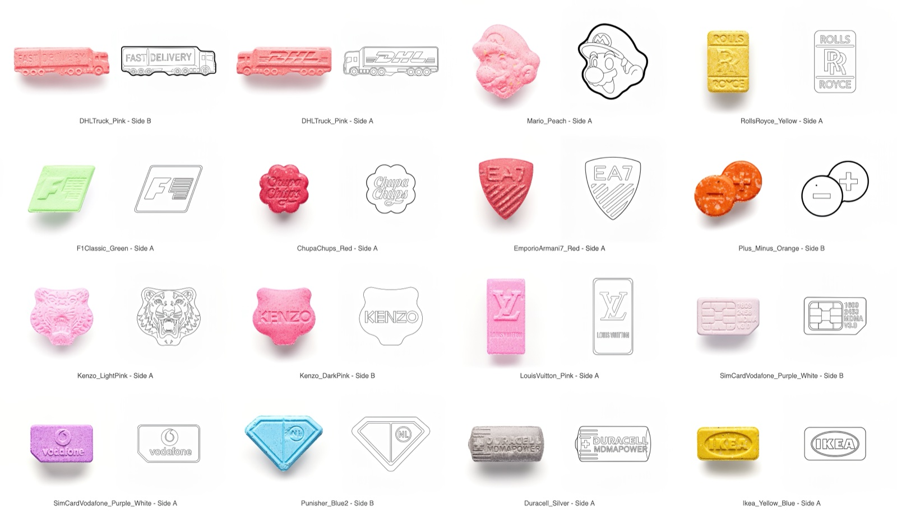

<p align="center">
  
</p>

# Candy Trace

> Product photos in, print-ready line art out.

<p align="center">
  
</p>

Give it a few hundred product photos and it turns them into 1-bit line drawings in one run, all in the same house style.

- **Tracing one item by hand takes about twenty minutes.** A library of 272 items is over 90 hours. Now it is one batch that runs while you do something else, with an approval step before anything goes into the library.
- **Only the drawing is AI.** Sorting, style matching, batching and the archive are plain code. That is why results are consistent.
- **Every PNG carries its own prompt** in the metadata. A trace made today can be regenerated the same way years from now.
- **Local-first.** Runs as a web app or a native macOS app. Your photos never leave your machine except for the Gemini API call, with your own key.

**Status: working prototype.** It does the full job end to end; the rough edges are under [Known limitations](#known-limitations).

---

## How it works

Upload style references → upload photos → auto-match → run the batch → approve → export as ZIP.

- **Style-aware tracing.** You supply reference pairs: a photo plus a hand-made trace. The model learns line weight, bevels and imprinted text from *your* examples, not a generic style.
- **Shape buckets first.** Every photo is classified into one of 18 shape buckets (round, oval, shield, hex, bar…) before matching, so a hexagonal tablet gets a hexagonal reference. Defined in `constants.ts`.
- **Two sides as a pair.** *Compare Sides* asks the model whether side B differs enough to need its own trace, or can reuse side A.

Models: `gemini-2.5-flash-image` for the drawing, `gemini-2.5-flash` for classification and side comparison.

---

## Quick start

```bash
npm install
npm run dev          # http://localhost:3000
```

Go to **Settings → API Key** and paste a key from [aistudio.google.com/apikey](https://aistudio.google.com/apikey). It is stored in your browser only and sent nowhere but Google.

> **Image generation needs a paid Google Cloud project.** The free tier has no quota for `gemini-2.5-flash-image` and returns HTTP 429. Classification does work on the free tier.

Other commands:

```bash
npm run build        # web build → dist/
npm run typecheck    # tsc --noEmit
npm run app:dev      # Tauri dev with hot reload
npm run app:build    # macOS .app + .dmg → src-tauri/target/release/bundle/
```

The macOS build needs [Rust](https://rustup.rs) and Xcode command line tools. It is **not code-signed**: right-click → *Open* on first launch, or `xattr -dr com.apple.quarantine "/Applications/Candy Trace.app"`.

Never set `GEMINI_API_KEY` in `.env` for a build you distribute — Vite inlines it into the bundle.

---

## File naming

Side detection and style pairing depend on these patterns.

```
MyPill_A.jpg   MyPill_B.jpg          photos:  [Name]_[A|B|1|2|front|back].[jpg|png|webp]
ThickContour_A.jpg                   style photo:  [Name]_[A|B].[jpg|png|webp]
ThickContour_trace_A.png             style trace:  [Name]_trace_[A|B].png
```

---

## Data

- Libraries, sessions, archive and settings live in **IndexedDB**, in your browser.
- **Snapshots** save and restore a named copy of the whole workspace (*Settings → Data & Backups*).
- **Google Cloud Storage sync** is optional and off by default.
- Clearing site data deletes your libraries. Snapshot first.

---

## Tech stack

React 19 · TypeScript · Tailwind CSS 3 · Vite 6 · Tauri 2 · `@google/genai` · IndexedDB via `idb`

---

## Known limitations

These are real and known, not hidden:

- **No code signing.** The macOS bundle triggers Gatekeeper on first launch.
- **Large libraries render eagerly.** Several hundred items in one view will be slow; no list virtualization yet.
- **Batch processing is not resumable.** Closing the window mid-batch loses in-flight progress.
- **Single JS bundle (~980 kB).** No code splitting yet.
- **`classificationCache.ts`** ships pre-computed results keyed by file hash. Speeds up repeat runs on the original dataset; inert for new images.
- **UI is English only.**

---

## License

MIT — see [LICENSE](LICENSE).
